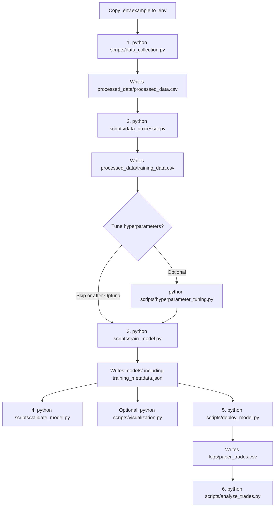

# AI Trading Bot

Python project for Nifty options research: collect Dhan option-chain data, train a PPO reinforcement-learning model, then optionally paper or live-deploy it.

Generated data, models, and logs are not in git. A fresh clone has scripts and config only.

## What is in this repo

```
ai_trading_bot/
├── .env.example              # Copy to .env; never commit .env
├── .gitignore
├── README.md
├── requirements.txt
├── setup.py
├── test_imports.py
├── run_script.sh             # Server cron helper (2025 holidays, conda paths)
├── ai_trading_bot_logrotate
├── processed_data/.gitkeep   # CSVs are created at runtime
└── scripts/
    ├── data_collection.py    # Dhan option chain + PCR metrics
    ├── data_processor.py     # Archive / trim training CSVs
    ├── trading_env.py        # Gymnasium env (hold / buy / sell)
    ├── train_model.py        # PPO training
    ├── hyperparameter_tuning.py  # Optuna
    ├── validate_model.py     # Standard + time-series validation
    ├── deploy_model.py       # Live/paper deploy
    ├── analyze_trades.py     # Reads logs/paper_trades.csv
    ├── visualization.py      # Training plots from models/training_metadata.json
    └── utils.py
```

These directories are created when you run the scripts; they are gitignored:

- `processed_data/` — `training_data.csv`, `processed_data.csv`, `archive/`
- `pre_processed_data/` — raw collector output
- `models/` — PPO zip, VecNormalize, param JSON
- `logs/` — train/eval logs, deployment trade history
- `optuna/` — study databases and plots

## Configuration

```bash
cp .env.example .env
```

| Variable | Required for | Notes |
| --- | --- | --- |
| `DHAN_CLIENT_ID` | data collection, deploy | Dhan client id |
| `DHAN_ACCESS_TOKEN` | data collection, deploy | Dhan API token |
| `DHAN_ACCESS_TOKEN_EXPIRY` | data collection | `YYYY-MM-DD`; used for expiry warnings |
| `TELEGRAM_BOT_TOKEN` | optional | Alerts |
| `TELEGRAM_CHAT_ID` | optional | Alerts |

Never commit `.env`.

## Install

TA-Lib is required by `requirements.txt`.

macOS:

```bash
brew install ta-lib
```

Then:

```bash
git clone https://github.com/KushalAzza/ai_trading_bot.git
cd ai_trading_bot
python3 -m venv venv
source venv/bin/activate
pip install -r requirements.txt
pip install -e .
cp .env.example .env
```

`setup.py` installs a shorter dependency list than `requirements.txt`. Use `requirements.txt` for a full run (Dhan, Optuna, torch, plotly).

## Usage

Run in this order. `trading_env.py` is imported by train, validate, and deploy; it is not a CLI. `test_imports.py` is an optional smoke test.



Cron: `run_script.sh` only runs `data_collection.py` during market hours. Set `PROJECT_ROOT` if the project is not at `$HOME/ai_trading_bot`. Holiday dates in that script are for 2025.

```bash
python scripts/data_collection.py
python scripts/data_processor.py

python scripts/hyperparameter_tuning.py --trials 5 --jobs 1
python scripts/hyperparameter_tuning.py --timeout 14400 --jobs 4 --train

python scripts/train_model.py
python scripts/train_model.py --optimize
python scripts/train_model.py --retrain

python scripts/validate_model.py
python scripts/visualization.py
python scripts/deploy_model.py
python scripts/analyze_trades.py
python test_imports.py
```
